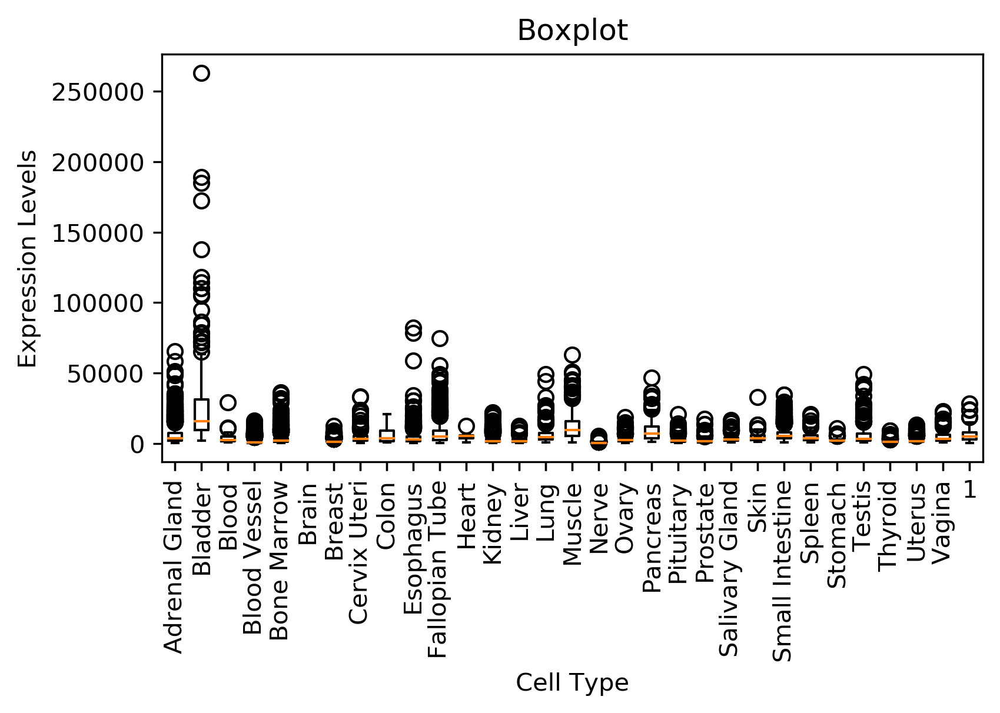

# parallel-arrays-profiling-and-benchmarking-sahu0957
This program generates a gene expression boxplot(s) from input data

## Installation
This program should be run in a conda environment. Install conda and its dependencies as follows:
```sh
wget https://repo.anaconda.com/miniconda/Miniconda3-latest-Linux-x86_64.sh
bash Miniconda3-latest-Linux-x86_64.sh -b
~/miniconda3/etc/profile.d/conda.sh
conda update --yes conda
conda config --add channels r
conda create --yes -n test
conda activate test
conda install -y pycodestyle
conda install --yes python=3.6
conda install matplotlib
conda install conda install -c conda-forge time
```
Note that this repository relies on a submodule from https://github.com/cu-swe4s-fall-2019/hash-tables-sahu0957.git. As such, it is critical to initiate the submodule through the code below: 

```sh
git submodule update --init
```

## Running the Program
specify input files and parameters for plot_gtex.py. This will require a gene counts file, a metadata file, a gene of interest, a metadata column of interest, where to store output, and the desired search method to use (linear, binary, or hash)
```sh
python plot_gtex.py --gene_reads /path/to/reads/data --sample_attributes /path/to/metadata --gene "Gene of interest" --group_type "Metadata of interest" --output_file /path/to/output --search_type (linear, binary, hash)
```
## Benchmarking and Profiling
Profiling and benchmarking results can be found in the following files:

```sh
less plot_gtex.binary_search.txt
less plot_gtex.linear_search.txt
less plot_gtex.hash_search.txt
less benchmarking.txt
```

The first two files show profiling results of the entire script plot_gtex.py, while the last file is a benchmarking result comparing the linear, hash, and binary search algorithms. Binary searches are much quicker, although 52% of the time is spent sorting the file before searching. The binary search option is even faster than setting up a hash table in this instance, although this may vary on size and complexity of the input files. The total time for running each module on the included example files is as follows:\

```sh
Linear search: 15.87 seconds\
Binary search: 1.81 seconds\
Hash table search: 2.40 seconds\
```
As such, it is recommended that users use the binary search module.

## Testing the Program
The files test_data_viz.py, test_plot_gtex.py, test_plot_gtex.sh are test files to make sure the scripts are running properly, and will perform a suite of unit and functional tests on the scripts
```sh
python test_data_viz.py
python test_plot_gtex.py
bash test_plot_gtex.sh
```

Note that all of these tests are run in the .travis.yml CI before updating this repository on GitHub

## Example Output
Running the following in bash will output a boxplot of gene counts for the specified gene and group type:

```sh
SAMPLE_ATTR=GTEx_Analysis_v8_Annotations_SampleAttributesDS.txt
GENE_READS=GTEx_Analysis_2017-06-05_v8_RNASeQCv1.1.9_gene_reads.acmg_59.gct.gz
GENE=LDLR
GROUP=SMTS
OUTFILE='boxplot.png'
SEARCH='hash'
python plot_gtex.py \
        --gene_reads $GENE_READS \
        --sample_attributes $SAMPLE_ATTR \
        --gene $GENE \
        --group_type $GROUP \
        --output_file $OUTFILE \
        --search_type $SEARCH
```


## Release History
*2.0\
	*ADDED: Added hash-tables-sahu0957 submodule\
	*ADDED: Added hash table searching functionality in plot_gtex.py\
	*ADDED: Added x-axis tick labeling in data_viz.py\
	*ADDED: Profiling and Benchmarking information for hash table search option\
	*CHANGE: Updated functional and unit testing for plot_gtex and data_viz to accomodate new hash table submodule\
	*CHANGE: Updated .travis.yml file to update submodule correctly\
*1.0\
	*CHANGE: Updated data_viz.py to accept a list of lists as input, as well as x-axis, y-axis, and title information\
	*CHANGE: Updated plot_gtex.py to search through gene data and metadata, and output a boxplot using data_viz library\
	*CHANGE: Benchmarking and profiling data were generated, comparing linear and binary search algorithms\
	*CHANGE: Updated .travis.yml file to automatically perform functional/unit testing before updating GitHub repository\
    	*ADDED: Functional and unit testing scripts to ensure that all scripts are working properly

## To Contribute
1. Fork it (< https://github.com/cu-swe4s-fall-2019/parallel-arrays-profiling-and-benchmarking-sahu0957.git>)
2. Create your feature branch (`git checkout -b feature_branch`)
3. Commit your changes (`git commit -m 'add your notes'`)
4. Push to the branch (`git push origin feature_branch`)
5. Create a new Pull request
